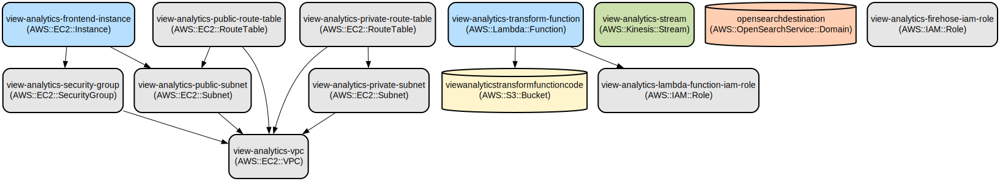

# Real-Time Product Analytics Platform with AWS Kinesis and OpenSearch

A scalable real-time analytics platform that captures product interaction data through a React frontend, processes it via AWS Kinesis streams, and enables search and visualization using OpenSearch.

This project implements a complete data pipeline for real-time product analytics. The frontend allows users to input product information, which is sent to a Node.js backend proxy server. The server forwards the data to AWS Kinesis streams for real-time processing. The data is then transformed using AWS Lambda and stored in OpenSearch for analysis and visualization. The entire infrastructure is managed using Terraform for Infrastructure as Code (IaC).

## Repository Structure
```
.
├── backend/                      # Node.js proxy server for Kinesis
│   ├── package.json             # Backend dependencies and scripts
│   └── server.js                # Express server implementation
├── frontend/                    # React TypeScript frontend application
│   ├── src/                     # Frontend source code
│   │   ├── App.tsx             # Main React component
│   │   └── main.tsx            # Application entry point
│   └── package.json            # Frontend dependencies and scripts
├── lambda_function/            # AWS Lambda data transformation
│   └── lambda.py              # Python Lambda handler
└── terraform/                  # Infrastructure as Code
    ├── main.tf                # Main Terraform configuration
    ├── modules/               # Reusable Terraform modules
    │   ├── ec2/              # EC2 instance configuration
    │   ├── firehose/         # Kinesis Firehose delivery
    │   ├── kinesis/          # Kinesis streams setup
    │   ├── lambda/           # Lambda function configuration
    │   ├── opensearch/       # OpenSearch domain setup
    │   └── vpc/              # VPC and networking
    └── scripts/              # Infrastructure setup scripts
```

## Usage Instructions
### Prerequisites
- Node.js >= 18.0.0
- AWS CLI configured with appropriate credentials
- Terraform >= 1.0.0
- Python >= 3.12 (for Lambda function)
- Git

### Installation

1. Clone the repository:
```bash
git clone <repository-url>
cd <repository-name>
```

2. Install backend dependencies:
```bash
cd backend
npm install
```

3. Install frontend dependencies:
```bash
cd ../frontend
npm install
```

4. Deploy infrastructure:
```bash
cd ../terraform
terraform init
terraform plan
terraform apply
```

### Quick Start

1. Start the backend server:
```bash
cd backend
npm start
```

2. Start the frontend development server:
```bash
cd frontend
npm run dev
```

3. Access the application at `http://localhost:5173`

### More Detailed Examples

1. Adding a new product:
```typescript
const product = {
  name: "Example Product",
  description: "Product description",
  price: 99.99,
  category: "Electronics",
  sku: "PROD-123",
  stockQuantity: 100,
  imageUrl: "https://example.com/image.jpg"
};

await fetch('http://localhost:3001/api/kinesis', {
  method: 'POST',
  headers: {
    'Content-Type': 'application/json'
  },
  body: JSON.stringify({
    payload: product,
    timestamp: new Date().toISOString()
  })
});
```

### Troubleshooting

1. Kinesis Connection Issues
- Error: "Failed to send data to Kinesis"
- Solution: 
  ```bash
  # Check EC2 instance IAM role
  aws iam get-role --role-name view-analytics-instance-profile-role
  # Verify Kinesis stream exists
  aws kinesis describe-stream --stream-name view-analytics-stream
  ```

2. OpenSearch Access Issues
- Error: "Unable to connect to OpenSearch domain"
- Solution:
  - Verify security group settings
  - Check OpenSearch domain status:
    ```bash
    aws opensearch describe-domain --domain-name opensearchdestination
    ```

## Data Flow
The platform processes product data through a multi-stage pipeline from frontend capture to analytics storage.

```ascii
Frontend (React) --> Backend Proxy (Node.js) --> Kinesis Stream --> Lambda Transform --> OpenSearch
     |                                              |
     |                                              v
     +----------------------------------------> S3 Backup
```

Component interactions:
1. Frontend captures product data and sends it to the backend proxy
2. Backend proxy formats data and publishes to Kinesis stream
3. Kinesis stream triggers Lambda function for data transformation
4. Lambda processes records and enriches with metadata
5. Processed data is stored in OpenSearch for analytics
6. Backup copies are maintained in S3 for durability
7. Error handling and retries are implemented at each stage

## Infrastructure



### Lambda Functions
- `view-analytics-transform-function`: Python 3.12 Lambda for data transformation
  - Triggered by Kinesis stream events
  - Processes and enriches product data

### Storage
- S3 Bucket: `viewanalyticstransformfunctioncode`
  - Stores Lambda function code
  - Enables versioning
  - Configured for secure access

### Streaming
- Kinesis Stream: `view-analytics-stream`
  - On-demand capacity mode
  - 48-hour retention period
  - Monitors incoming and outgoing bytes

### Search
- OpenSearch Domain: `opensearchdestination`
  - Engine Version: OpenSearch 2.17
  - Instance Type: t3.small.search
  - EBS storage: 10GB
  - Encryption at rest enabled
  - Node-to-node encryption enabled

### Networking
- VPC: `view-analytics-vpc`
  - CIDR: 10.0.0.0/16
  - 3 public subnets
  - 3 private subnets
  - Internet Gateway
  - Security groups for controlled access

## Deployment

1. Prerequisites:
- AWS credentials configured
- Terraform installed
- Required IAM permissions

2. Infrastructure Deployment:
```bash
cd terraform
terraform init
terraform plan -out=tfplan
terraform apply tfplan
```

3. Application Deployment:
```bash
# Deploy backend
cd ../backend
npm install
npm start

# Deploy frontend
cd ../frontend
npm install
npm run build
```

4. Monitoring:
- Check CloudWatch logs for Lambda function
- Monitor Kinesis stream metrics
- View OpenSearch dashboard for analytics